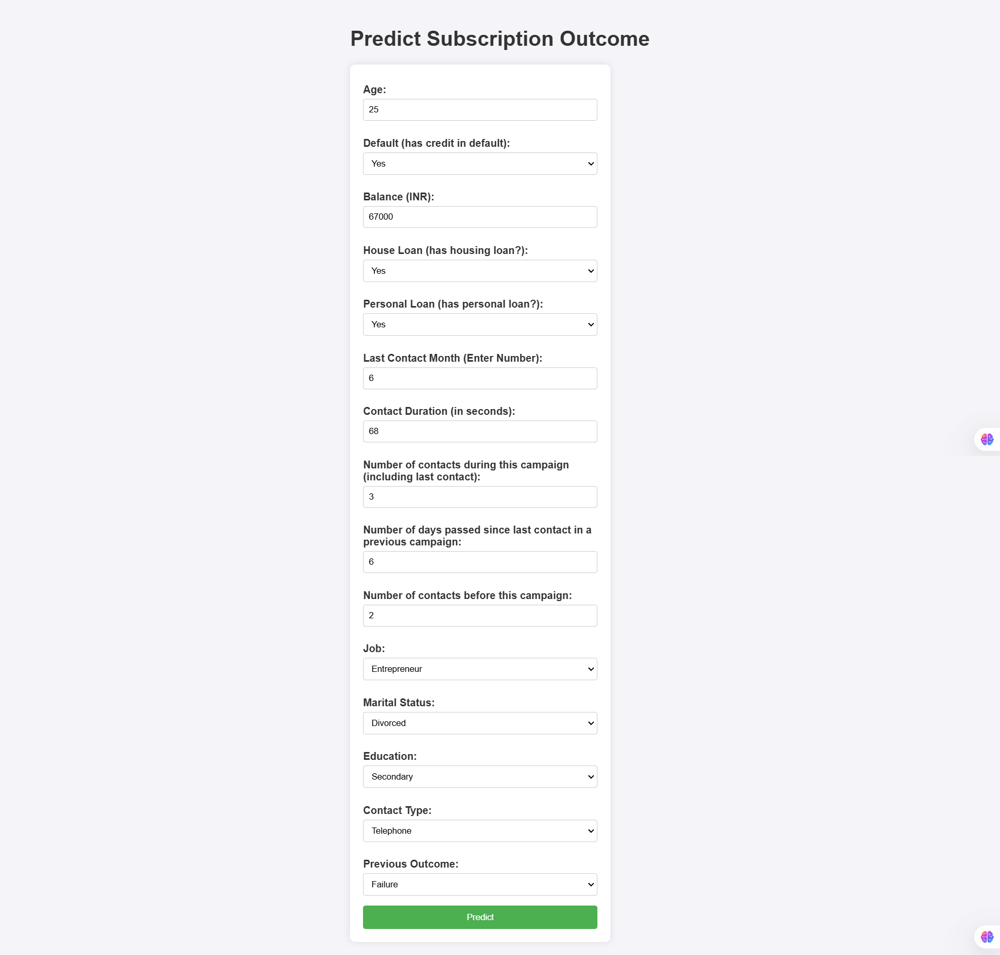

## Customer Subscription Prediction Web Application

### 📜 Description
This application is a machine learning-based web tool designed to predict customer subscription likelihood based on user inputs. Utilizing Flask for the backend and HTML for the frontend, it allows users to enter customer-related data, instantly returning a prediction on whether a customer is likely to subscribe. The app is deployed on Render, making it accessible online and easy to integrate into existing customer relationship management systems.

### 🎯 Project Objective
To develop an easy-to-use, accurate application that leverages machine learning to predict the likelihood of a customer's subscription, enhancing targeted marketing strategies by identifying high-potential leads.

### 📂 Project Structure
app.py: The core backend file responsible for handling user inputs, running predictions via the machine learning model, and serving results to the frontend.
index.html: A user-friendly HTML interface allowing customers to input details and view predictions.
Machine Learning Model: A high-performance predictive model optimized for accuracy in customer subscription likelihood. The model achieved:
Test Accuracy: 90.4%
ROC AUC Score: 0.93

### 🚀 Approach
Frontend: Simple HTML design to capture customer information for subscription prediction.
Backend: Built with Flask, processing user inputs and running the machine learning model.
Model Deployment: Hosted on Render for seamless, public accessibility.

### 🔑 Key Features
Real-time prediction of subscription likelihood based on customer input data.
Intuitive, user-friendly interface built with HTML.
Deployed on Render for easy access.

### 📊 Performance Metrics
Test Accuracy: 0.903
ROC AUC Score: 0.93

### 📸 Interface Preview

### ⚙️ Setup

**Prerequisites**  
Ensure you have Python 3.7+ and pip installed.

Clone the repository: 
git clone https://github.com/nakkkul/Customer-Subscription-Prediction-App.git 
cd Customer-Subscription-Prediction-App

Install dependencies: 
pip install -r requirements.txt 
Run the Flask application:

python app.py 
Access the application at http://localhost:5000 in your browser.

### 🌐 Deployment Link  
The live version of the application can be accessed here: https://customer-subscription-prediction-app.onrender.com
